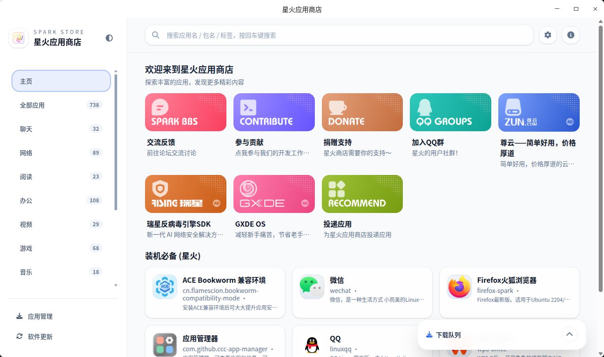

# 星火应用商店

**星火应用商店**

## 简介

欢迎来到**星火应用商店**！这是一个为 Linux 平台用户设计的应用商店，旨在解决 Linux 生态下应用分散、难以获取的问题。无论您使用什么类型的 Linux 发行版，在这里都有可能找到适合您的软件包。

Linux 应用的数量相对有限，Wine 软件的可获取性也颇为困难。优秀的开发套件和工具资源散布在各大社区和论坛之间，这种分散化让整个生态系统难以得到全面的提升。

生态系统的构建并非依赖个体的孤立努力，而需要全社区共同参与。只有当大家的“星火”聚集一处，方可引发“燎原之势”。

为了改善这一现状，我们推出了星火应用商店。星火社区广泛地收录了各种用户需求的软件包，汇集了高质量的小工具，并主动对 Wine 应用进行了适配，一切都储存在我们的软件库中，使得用户可以方便地获取这些应用。

**当前支持的 Linux 发行版包括（但不限于）：**

- **amd64 架构：** Debian 10+ / Ubuntu 22.04+ / Arch Linux / Fedora / deepin / UOS / 银河麒麟 
- **arm64 架构：** Debian 10+ / Ubuntu 22.04+ / Arch Linux / deepin / UOS / 银河麒麟 
- **loong64 架构：** deepin 23/25

对于不同平台，商店展示的应用列表不同，如有需要请提交应用需求，我们会尽快添加。

## 🚀 快速开始

### 安装应用商店

* Debian(包括Ubuntu、deepin、银河麒麟、UOS)

1. 从 Release 下载最新版本的应用商店客户端。
2. 从启动器中打开并使用

* Fedora

1. `sudo dnf copr enable xmp360/spark-store`
2. `sudo dnf install spark-store`

* Arch Linux

1. `paru -S spark-store`

---

## 📦 关于 APM

**APM (AmberPM)** 是基于 `fuse-overlayfs` + `dpkg` + `AmberCE` 的容器化兼容层，为多发行版提供轻量级的应用运行方案。星火的 Arch Linux 版本和 Fedora 版本基于APM实现支持。

### 核心特性

✅ **多发行版兼容** — 完美支持 Arch Linux、Fedora、银河麒麟、统信 UOS 等主流发行版，让星火商店应用随处可用  
🔄 **智能包转换** — 与 Debian 生态深度兼容，绝大多数 deb 包可一键自动转换为 APM 格式  
⚡ **轻量兼容层** — 基于 overlayfs 技术打造，极速启动无负担，告别臃肿容器  
🎮 **NVIDIA 硬件加速** — 智能识别主机 GPU 驱动，自动配置硬件加速，畅享流畅体验

APM的源码：[APM Source Code](https://gitee.com/amber-ce/amber-pm)

---

**重要须知：** 本软件无法保证持续可用、无中断运行或满足特定性能要求。星火社区对其功能完整性、稳定性及无错误运行不作任何承诺。例如，若您计划在 UOS 专业版（或其他类似特定平台）上使用，请务必了解并启用“开发者模式”相关功能。请确保您具备基础的故障排查能力。需要明确的是，星火社区无法在部分特殊平台上进行广泛测试。因此，在这些平台上使用星火应用商店客户端可能会导致一系列问题，如系统更新失败、数据丢失等；使用该软件，即代表您理解并同意所有风险需由用户自行承担。

**© 2026 APM / AmberPM | The Spark Project**

Made with ❤️ by the Spark Store Team

